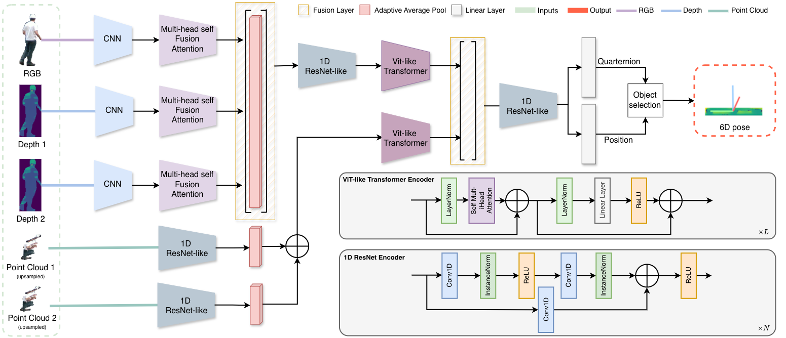

# Attention-Based Multimodal Fusion for Robust 6D Pose Estimation in Cluttered Industrial Environments

---

## Abstract

Reliable 6D pose estimation in industrial environments remains challenging due to clutter, occlusions, variable illumination, and limited texture, as well as noisy or incomplete depth measurements. This paper presents a multimodal architecture for 6D pose estimation that combines RGB, depth maps, and 3D point clouds to improve robustness in such conditions.

The proposed network extracts image features with lightweight CNN backbones, refining and fusing modalities through multi-head attention, and encodes point cloud geometry with a ResNet1D-like stream. Global dependencies are captured by ViT-like transformer blocks before translation and quaternion orientation are regressed. This work also presents an industrial dataset and annotation pipeline, including an in-house tool for manual 6D pose labeling, comprising 338 frames with 6180 annotated instances across seven object classes within 0--20m. 

To study the impact of complementary depth sources, we evaluate two input configurations: camera-native depth combined with (i) a learned depth-estimation model and (ii) projected LiDAR depth. Using an ADD-based training objective, the best configuration (camera-native depth and LiDAR) achieves an average error of approximately 0.27m. Camera-native depth combined with learned depth yields comparable performance, demonstrating the potential of multimodal fusion for scalable industrial 6D pose estimation.

---

## Method Overview
The following figure illustrates the main pipeline of the proposed approach.

  

---

## Video
A short video illustrating the method and results is available here:

▶️ https://youtu.be/PL8Euqc-97M
